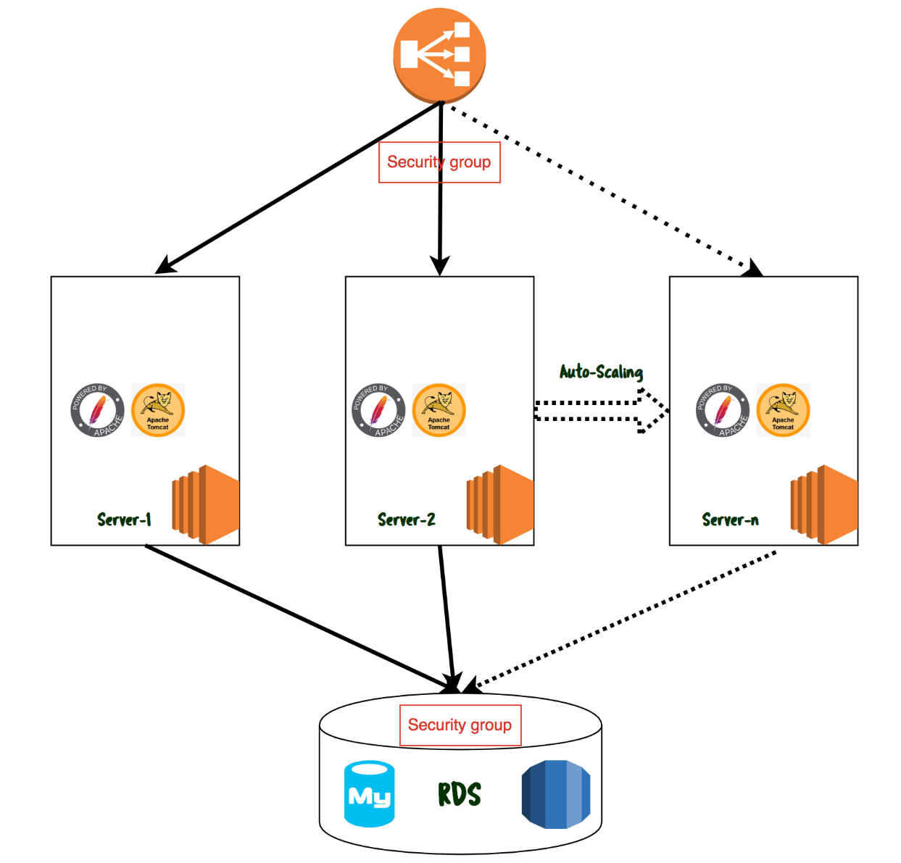

## Following is the application setup using different services in AWS.

###  **Proposal 1:**

1. For DB -> **RDS** 
2. Web Server and application server are preferred as single instance (**EC2**)
3. Use Auto-Scaling for high availability.

###  **Proposal 2:**

1. For DB -> **RDS** 
2. Using **Elastic BeanStalk** for application, **API Gateway** for Proxy

#### Technical configuration of **Proposal 1** 

We are looking to use the different services in AWS and the architecture look like as follows and that even supports High Availability.




#

## RDS Setup

For RDS to load the schema you can use the following sql file 

```sql
use studentapp;
CREATE TABLE if not exists students(student_id INT NOT NULL AUTO_INCREMENT,
	student_name VARCHAR(100) NOT NULL,
    student_addr VARCHAR(100) NOT NULL,
	student_age VARCHAR(3) NOT NULL,
	student_qual VARCHAR(20) NOT NULL,
	student_percent VARCHAR(10) NOT NULL,
	student_year_passed VARCHAR(10) NOT NULL,
	PRIMARY KEY (student_id)
);
```

#

## Setup Web Server .

Install Web Server 

```shell 
$ sudo yum install httpd -y
```

Update proxy config , Pointing to application server 

```shell 
$ cat /etc/httpd/conf.d/app-proxy.conf 
ProxyPass "/student" "http://localhost:8080/student"
ProxyPassReverse "/student"  "http://localhost:8080/student"
```

Download the default index file and restart service.

```shell 
$ sudo curl -s https://devops-cloudcareers.s3.ap-south-1.amazonaws.com/index.html -o /var/www/html/index.html
$ sudo systemctl enable httpd 
$ sudo systemctl restart httpd 
```

#

## Setup Application Server 

Usually we run applications with one functional user in companies (Bot not with root user). So we are going to create one user and we run our application with that user. So application is based out of student admissions we can create a user with that name or any name of choice. 

Create an application user with name `student`. 

```shell 
$ sudo useradd student 
```

Our application is based out of java, So application server you are installing is also based on Java. Hence you need to install Java. 

```shell 
$ sudo yum install java 
```

Now perform all the following commands with `student` user. 

```shell 
$ sudo su - student 
student> wget -qO- https://archive.apache.org/dist/tomcat/tomcat-8/v8.5.75/bin/apache-tomcat-8.5.75.tar.gz | tar -xz 
student> cd apache-tomcat-8.5.75
```

Student Admission application compiled latest version is available in following URL and you have to download that to application server.

```shell
student> wget https://devops-cloudcareers.s3.ap-south-1.amazonaws.com/student.war -O webapps/student.war
```

In order our application server to contact database we need the driver of DB and we have to download that from following URL.

```shell
student> wget https://devops-cloudcareers.s3.ap-south-1.amazonaws.com/mysql-connector.jar -O lib/mysql-connector.jar
```

Finally we need to provide the information of DB details to the application server and those credentials are referred by our application.
Usually such configuration files are kept under `context.xml` file.

Add the following content by replacing the values of USERNAME, PASSWORD, DB-ENDPOINT and DATABASE in the following block and add these lines just before the last line in context.xml.

```xml
<Resource name="jdbc/TestDB" auth="Container" type="javax.sql.DataSource"
               maxTotal="100" maxIdle="30" maxWaitMillis="10000"
               username="USERNAME" password="PASSWORD" driverClassName="com.mysql.jdbc.Driver"
               url="jdbc:mysql://RDS-DB-ENDPOINT:3306/DATABASE"/>
``` 

Finally we have to start the tomcat application server.

```shell 
student> /home/student/apache-tomcat-8.75/bin/startup.sh 
```

Refer the log file `catalina.out` and ensure there were no errors in the startup log. 

If we run the startup script manually then that service cannot be started at the time of reboot, So we wanted to take care of startup using `systemctl` command. That will take care of starting our application during reboot and as well as with `systemctl` command.

```


