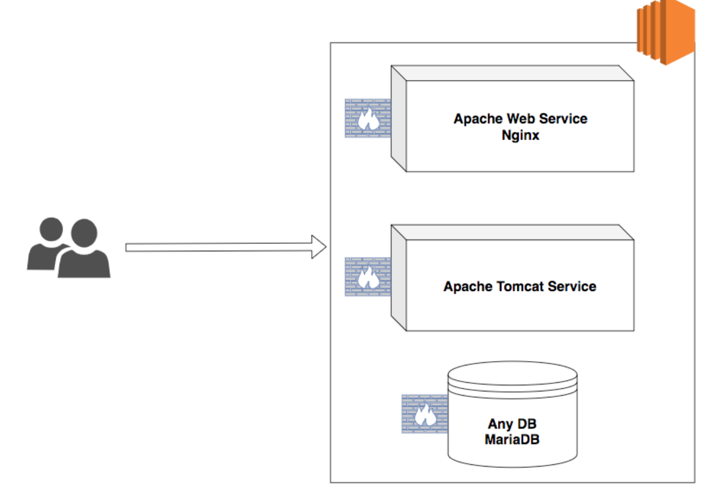

# Documentaion to setup registration application on servers.

In total we do require three servers running different components on the server.

1. Web Server 
2. Application Server 
3. Database Server 


Following are the softwares which are used for different services.

1. Apache Web Server for Web Server 
2. Apache Tomcat for Application Server 
3. MariaDB for Database Server 

Following the Diagram been referred to setup application




Following are the technicalities for the tools 

1. Apache Web Server 2.4.x 
2. Tomcat App Server 8.5.x 
3. MariaDB Server 10.x

OS can be either Ubuntu or CentOS, But this document would be on Centos 8.

#

### 1. Ensure you use the AMI `DevOps-LabImage-Centos-8` in North.Virginia Region and this AMI works with username and password ( centos / DevOps321 ), without which lot of challenges would be coming up.

Install Web Server 

```shell 
$ sudo yum install httpd -y
```

Update proxy config , Pointing to application server 

```shell 
$ cat /etc/httpd/conf.d/app-proxy.conf 
ProxyPass "/student" "http://APP-SERVER-IPADDRESS:8080/student"
ProxyPassReverse "/student"  "http://APP-SERVER-IPADDRESS:8080/student"
```

*Note: Replace APP-SERVER-IPADDRESS with IP address of tomcat server * 

```shell 
$ sudo curl -s https://raw.githubusercontent.com/b57-clouddevops/Student-Project/main/artifacts/index.html -o /var/www/html/index.html
$ sudo systemctl enable httpd 
$ sudo systemctl restart httpd 
```

#

## 2. Setup Application Server 

Usually we run applications with one functional user in companies (Bot not with root user). So we are going to create one user and we run our application with that user. So application is based out of student admissions we can create a user with that name or any name of choice. 

Create an application user with name `student`. 

```shell 
$ sudo useradd student 
```

Our application is based out of java, So application server you are installing is also based on Java. Hence you need to install Java. 

```shell 
$ sudo yum install java 
```

Now perform all the following commands with `student` user. 

```shell 
$ sudo su - student 
student> wget https://dlcdn.apache.org/tomcat/tomcat-8/v8.5.99/bin/apache-tomcat-8.5.99.tar.gz ; tar -xf apache-tomcat-8.5.99.tar.gz
student> cd apache-tomcat-8.5.99
```

Student Admission application compiled latest version is available in following URL and you have to download that to application server.

```shell
student> wget https://s3.amazonaws.com/www.thecloudcareers.com/student.war -O webapps/student.war
```

In order our application server to contact database we need the driver of DB and we have to download that from following URL.

```shell
student> wget https://s3.amazonaws.com/www.thecloudcareers.com/mysql-connector.jar -O lib/mysql-connector.jar

```

Finally we need to provide the information of DB details to the application server and those credentials are referred by our application.
Usually such configuration files are kept under `conf/context.xml` file.

Add the following content by replacing the values of USERNAME, PASSWORD, DB-ENDPOINT and DATABASE in the following block and add these lines just before the last line in context.xml.

```xml
<Resource name="jdbc/TestDB" auth="Container" type="javax.sql.DataSource"
               maxTotal="100" maxIdle="30" maxWaitMillis="10000"
               username="USERNAME" password="PASSWORD" driverClassName="com.mysql.jdbc.Driver"
               url="jdbc:mysql://DB-ENDPOINT:3306/DATABASE"/>
``` 

Finally we have to start the tomcat application server.

```shell 
student> /home/student/apache-tomcat-8.5.99/bin/startup.sh 
```

Refer the log file `catalina.out` and ensure there were no errors in the startup log. 

## 3. Setup Database 

Install DB Server and start the service 

As our application is chosen to drive on MariaDB we have to install those packages.

```shell
$ sudo yum install mariadb-server -y
$ sudo systemctl enable mariadb 
$ sudo systemctl start mariadb
```

So far only the DB software is installed and it does not have any database inside it. So we have to create database and required tables on it. 

```shell 
$ wget https://s3.amazonaws.com/www.thecloudcareers.com/studentapp-ui-proj.sql -O /tmp/studentapp.sql 
$ sudo mysql </tmp/studentapp.sql

```

Finally if we hit the Web Server Public IP then we would be able to fetch application and application will start updating the students data in database. 
